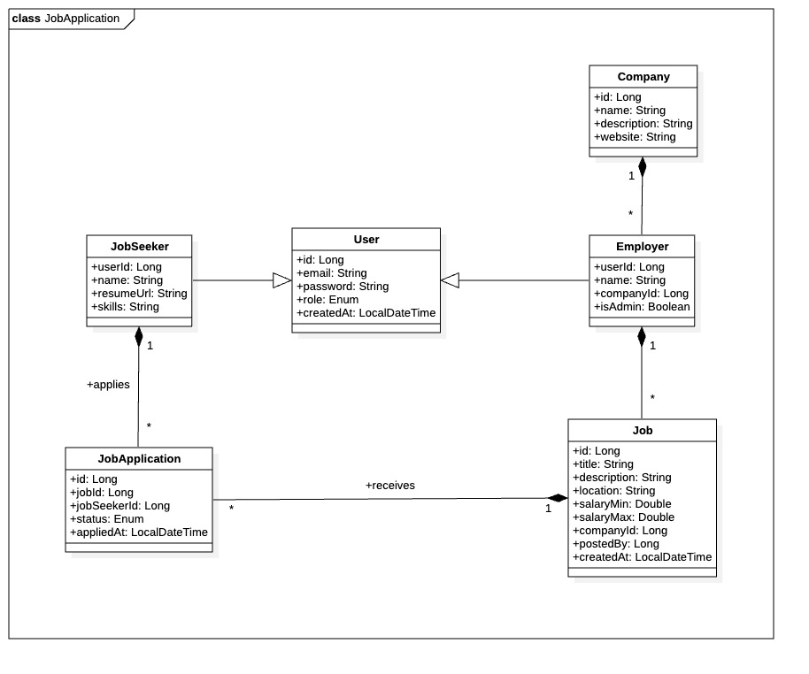

# Job Application API

## Overview  
This project is a **Job Application Management API** built with **Java, JDBC, and Maven**. It provides functionality to manage job applications, track statuses, and interact with a database for storing job-related data.  


## Class Diagram 


## Features  
- Add, update, and delete job applications  
- Track application status (applied, interviewing, accepted, rejected)  
- Retrieve job details from the database  
- Designed with **JDBC** for database interaction  
- Built and managed using **Maven**  

## Technologies Used  
- **Java** (Backend logic)  
- **JDBC** (Database connectivity)  
- **Maven** (Dependency management)  
- **MySQL** (Used Database)  

## Installation  

1. Clone the repository:  
   ```bash
   git clone https://github.com/dissojak/JavaProject-1ere-tekup.git
   cd JavaProject-1ere-tekup
   ```
2. Check & Install the needed JDK:
   ```bash
   javac -version
   resualt should be : javac 23.0.2
   ```
4. Build the project with Maven ( install it first ):  
   ```bash
   mvn clean install
   ```  
5. Configure the database connection under `config/DatabaseConfig.java`  
6. Run the application:  
   ```bash
   USE POSTMAN FOR TESTING ROUTES
   ```  

## API Endpoints  
| Method | Endpoint | Description |  
|--------|----------|-------------|  
| GET | `/applications` | Get all job applications |  
| POST | `/applications` | Add a new job application |  
| PUT | `/applications/{id}` | Update a job application |  
| DELETE | `/applications/{id}` | Delete a job application |  

## Contributing  
Feel free to submit issues or pull requests if you want to improve this project.  

## License  
This project is licensed under [MIT License](LICENSE).
